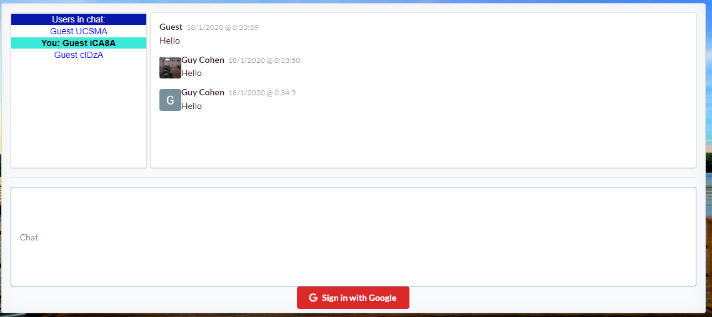

## Group Chat

This project will display a groupchat with google login authntication.

## Server Side

The server side of this project is uploaded to Heoku repository.
But you can see the server side code in this github repository.

## Client Side

### Link

https://guy490.github.io/GroupChat/

- ##### PC view:

- ##### Mobile view:

- ##### At the left side you can see the current Logged In users:

- ##### At the right side you can see the chat and text messages:

- ##### Login with google authintication:

### Run this app localy on your computer -> `npm start`

Runs the app in the development mode. 
Open [http://localhost:3000](http://localhost:3000) to view it in the browser.
